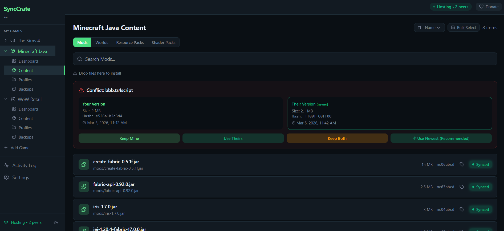

<p align="center">
  
</p>

<h1 align="center">SyncCrate</h1>

<p align="center">
  <strong>The easiest way for friends to keep modded games perfectly in sync.</strong>
</p>

<p align="center">
  <a href="../../releases/latest"></a>
  
  
</p>

<p align="center">
  <a href="../../releases/latest">Download</a>&nbsp;&nbsp;&bull;&nbsp;&nbsp;<a href="https://stixez.github.io/SyncCrate">Website</a>&nbsp;&nbsp;&bull;&nbsp;&nbsp;<a href="#quick-start">Quick Start</a>&nbsp;&nbsp;&bull;&nbsp;&nbsp;<a href="#building-from-source">Build from Source</a>
</p>

---

### Highlights

- **Peer-to-peer at LAN speed** — Files transfer directly between computers at 100-900 MB/s. No cloud, no uploads, no waiting.
- **Smart file diffing** — Compares SHA-256 hashes and only transfers what actually changed.
- **15 games, 7 families** — Sims, WoW, Minecraft, CS2, Garry's Mod, Stardew Valley, Warcraft III. Data-driven registry — adding a game is just JSON.
- **Multi-peer sessions** — One host, multiple friends. Everyone syncs independently.
- **Conflict resolution** — Keep yours, use theirs, or keep both — per file.
- **Mod profiles & backups** — Snapshot your setup, export a `.synccrate-profile` file, share it on Discord — friends drag it into the app and they're done. Safety backup before every restore.
- **Privacy-first** — No servers, no accounts, no tracking, no data collection. Nothing leaves your network.
- **Dangerous file warnings** — Flags potentially risky script files (`.ts4script`, `.lua`, `.jar`, `.dll`) per game before sync.

---

## The Problem

Playing modded games with friends often turns into a mess of shared zip files, outdated mods, and broken saves. Someone always ends up with a missing mod, a different version, or incompatible configs. Multiplayer sessions break before they even start.

## The Solution

SyncCrate compares game folders between players and transfers only the files that differ. Everyone ends up with the same mods, the same versions, and the same configuration — in minutes, not hours.

No cloud services. No accounts. No file uploads. Files move peer-to-peer at full LAN speed, verified with SHA-256 checksums.

---

## Screenshots

<p align="center">
  
</p>
<p align="center"><em>Dashboard — Session overview, sync plan, and connected peers</em></p>

| Content Browser | Profiles |
|:-:|:-:|
|  |  |
| *Browse, tag, and manage mods* | *Snapshot and share mod setups* |

---

## Supported Games

| Game | Content Types | Auto-Detect |
|------|--------------|:-----------:|
| **The Sims 4** | Mods, Saves, Tray, Screenshots | Yes |
| **The Sims 3** | Mods & CC, Saves, Tray, Screenshots | Yes |
| **The Sims 2** | Mods & CC, Neighborhoods, Tray, Screenshots | Yes |
| **WoW Retail** | Addons, Addon Settings | Yes |
| **WoW Classic** | Addons, Addon Settings | Yes |
| **WoW Classic Era** | Addons, Addon Settings | Yes |
| **WoW WoTLK (3.3.5)** | Addons, Addon Settings | Manual |
| **WoW TBC (2.4.3)** | Addons, Addon Settings | Manual |
| **WoW Vanilla (1.12)** | Addons, Addon Settings | Manual |
| **WoW Custom Server** | Addons, Addon Settings | Manual |
| **Warcraft III** | Custom Maps | Yes |
| **Minecraft Java** | Mods, Worlds, Resource Packs, Shader Packs | Yes |
| **Counter-Strike 2** | Maps, Configs | Yes |
| **Garry's Mod** | Addons, Maps, Saves | Yes |
| **Stardew Valley** | SMAPI Mods | Yes |

Games are defined in a [JSON registry](synccrate/src-tauri/src/game_registry.json). Want your game supported? Add an entry — no code changes required. See [Contributing](#contributing).

---

## Common Use Cases

**Playing modded games with friends** — Keep everyone's mods, saves, and configs synchronized so multiplayer sessions never break.

**Sharing mod collections** — Select the mods you want, click export, and share the `.synccrate-profile` file on Discord or anywhere else. Friends just drag it into the app and they're set.

**WoW private server addon sync** — WoTLK, TBC, Vanilla, and custom server communities can't use official addon managers. SyncCrate fills that gap.

**Managing large mod libraries** — Organize with tags, enable/disable mods without deleting, create backups, and filter by category.

---

## How SyncCrate Works

1. **Discover peers** — SyncCrate finds other users on the network via mDNS (or connect manually by IP).
2. **Scan game folders** — Both sides generate SHA-256 file hashes.
3. **Compare files** — Differences are detected and categorized: download, upload, or conflict.
4. **Build sync plan** — Review what will transfer. Exclude files, resolve conflicts, apply filters.
5. **Transfer files** — Files move peer-to-peer over TCP at full LAN speed.
6. **Verify integrity** — Every file is hash-verified after transfer.

---

## Features

| | Feature | Description |
|-|---------|-------------|
| **P2P** | Peer-to-peer transfer | Files move directly between computers. Nothing leaves your network. |
| **Multi** | Multi-peer sessions | One host, multiple clients. Each client syncs independently. |
| **Games** | Multi-game support | 15 games across 7 families. Data-driven registry — adding games is just JSON. |
| **mDNS** | Auto-discovery | Finds peers on your network automatically. No IPs to configure. |
| **Diff** | Smart diffing | Compares file hashes. Only transfers what's actually different. |
| **Resolve** | Conflict resolution | Keep yours, use theirs, or keep both — per file. |
| **Tags** | Mod tagging | Organize mods with 12 built-in tags. Bulk-tag, filter, and search. |
| **Selective** | Selective sync | Exclude individual files or use glob patterns. Quick filters by category. |
| **Backup** | Backup & restore | Full snapshot of game content folders. Safety backup before every restore. |
| **DnD** | Drag & drop install | Drop mod files onto the mod list to install. |
| **DLC** | Pack detection | Detects installed expansion/game/stuff packs and warns about mod compatibility. |
| **Profiles** | Mod profiles | Snapshot your mod setup per game. Export/import as `.synccrate-profile` files. |
| **Perms** | Host permissions | Hosts control which folders peers can sync. |
| **SHA-256** | Integrity verification | Every file is hash-verified after transfer. |
| **Security** | Dangerous file warnings | Flags risky script files (`.ts4script`, `.lua`, `.jar`, `.dll`) before syncing. |
| **Toggle** | Mod enable/disable | Disable mods without deleting them. Moves files to a `_Disabled` folder and back. |
| **Details** | Mod details panel | Click any mod to view full details — path, size, hash, tags, compatibility, and quick actions. |
| **Theme** | Light & dark theme | Toggle between dark and light mode from the sidebar. Preference persists across sessions. |
| **Retry** | Auto-reconnect | Automatic reconnection with exponential backoff if the connection drops unexpectedly. |
| **Live** | Real-time progress | File counts, byte totals, and percentage during sync. |
| **Update** | Auto-update | Check for and install updates directly from the app. |

---

## Download

Get the latest release for your platform from the **[Releases](../../releases/latest)** page.

| Platform | Format |
|----------|--------|
| Windows | `.exe` installer |
| macOS (Apple Silicon) | `.dmg` |
| macOS (Intel) | `.dmg` |
| Linux | `.AppImage` / `.deb` |

> **macOS users:** The app is not signed/notarized yet. macOS will show "app is damaged" on first launch. To fix this, open Terminal and run:
> ```
> xattr -cr /Applications/SyncCrate.app
> ```
> Then open SyncCrate normally. You only need to do this once.

---

## Quick Start

### 1. Install

Download and run SyncCrate on each computer. On first launch a welcome screen helps you add games to your personal library.

### 2. Add Games

Browse the Game Browser to add supported games to your library. SyncCrate auto-detects installed game folders where possible. Each game in your library gets its own sidebar entry with Dashboard, Content, Profiles, and Backups pages.

### 3. Connect

Both players need to be on the **same network** — same Wi-Fi, same router, or a virtual LAN like [Tailscale](https://tailscale.com) or [ZeroTier](https://www.zerotier.com).

| Role | Action |
|------|--------|
| **Host** | Enter a display name > **Start Hosting** |
| **Client** | Enter a display name > **Scan for Hosts** > click the host to connect |

### 4. Compare & Sync

Click **Compare & Sync** on the Dashboard. SyncCrate scans both mod folders and categorizes every file:

- **Download** — files the peer has that you don't
- **Upload** — files you have that the peer doesn't
- **Conflict** — same file exists on both sides with different contents

Use selective sync to exclude files you don't want, resolve conflicts in the **Content** tab, then click **Sync Now**.

### 5. Done

Click **Disconnect** when finished. All transferred files are already saved.

---

## Remote Players

Not on the same physical network? SyncCrate works over any virtual LAN network. Popular options:

- **[Tailscale](https://tailscale.com)** — Free for personal use, easiest setup
- **[ZeroTier](https://www.zerotier.com)** — Free for up to 25 devices
- **Hamachi** or any VPN-based LAN solution

Both players install the virtual LAN tool and join the same network, then use SyncCrate normally — mDNS discovery works through virtual LANs.

---

## Mod Enable / Disable

Temporarily disable a mod without deleting it. Click any mod to open its details panel, then hit **Disable** — the file moves to `Mods/_Disabled/` so the game won't load it. Hit **Enable** to move it back. Disabled mods are visually dimmed in the list.

---

## Mod Tags

Organize your mods with 12 built-in tags (Hair, Clothing, Build, Gameplay, etc.). Tag mods individually or in bulk, then filter the mod list by tag. Tag filter pills show counts so you can see your collection at a glance.

---

## Backup & Restore

Create a full backup of your game content folders at any time. Before every restore, SyncCrate automatically creates a safety backup so you can always roll back. Backups are per-game and shown with a game badge. Rename backups inline to keep them organized.

---

## Selective Sync

Not every file needs to sync. Exclude individual files from the sync plan with a checkbox, or set persistent glob patterns (e.g. `*.ts4script`) in Settings to always skip certain files. Quick filter buttons let you toggle entire categories.

---

## Mod Profiles

Profiles capture a snapshot of your current mod list, scoped to the active game.

| Action | How |
|--------|-----|
| Create | Profiles tab > **+** card > name & description |
| Export | Select mods or a profile > click export > share the `.synccrate-profile` file anywhere (Discord, email, etc.) |
| Import | Drag a `.synccrate-profile` file into the app, or click **Import** and select one |
| Compare | Click **Compare** on a profile card to diff against your current mods |
| Delete | Click the trash icon on a profile card |

---

## Keyboard Shortcuts

| Shortcut | Action |
|----------|--------|
| <kbd>Ctrl+Shift+S</kbd> / <kbd>Cmd+Shift+S</kbd> | Settings |
| <kbd>Ctrl+Shift+F</kbd> / <kbd>Cmd+Shift+F</kbd> | Focus search |
| <kbd>/</kbd> | Focus search (when not in a text field) |
| <kbd>Esc</kbd> | Close dialogs / clear search |

---

## Building from Source

### Prerequisites

- [Node.js](https://nodejs.org/) 18+
- [Rust](https://rustup.rs/) stable
- Platform dependencies per [Tauri v2 prerequisites](https://v2.tauri.app/start/prerequisites/)

### Build

```bash
git clone https://github.com/stixez/SyncCrate.git
cd SyncCrate/synccrate
npm install
npm run tauri dev        # development with hot reload
npm run tauri build      # production build with installer
```

Output: `src-tauri/target/release/bundle/`

---

## Architecture

| Layer | Technology |
|-------|-----------|
| Framework | [Tauri v2](https://v2.tauri.app/) |
| Backend | Rust |
| Frontend | React 19 + TypeScript + Vite |
| Styling | Tailwind CSS |
| State | Zustand |
| Networking | TCP (transfer) + mDNS (discovery) |
| Integrity | SHA-256 |

---

## FAQ

<details>
<summary><strong>Is there a file size limit?</strong></summary>
Individual files up to 2 GB. No limit on total sync size.
</details>

<details>
<summary><strong>Can more than two people sync at once?</strong></summary>
Yes. One person hosts, multiple friends join. Each client syncs independently with the host.
</details>

<details>
<summary><strong>Which games are supported?</strong></summary>
SyncCrate ships with 15 games across 7 families: Sims 2/3/4, WoW (Retail, Classic, Classic Era, plus WoTLK/TBC/Vanilla/Custom private servers), Warcraft III, Minecraft Java, CS2, Garry's Mod, and Stardew Valley. Games are defined in a JSON registry — adding new games requires no code changes.
</details>

<details>
<summary><strong>Does it work over the internet?</strong></summary>
Yes — with a virtual LAN like Tailscale, ZeroTier, or Hamachi. SyncCrate works on any network where devices can see each other. See <a href="#remote-players">Remote Players</a>.
</details>

<details>
<summary><strong>How fast is it compared to cloud syncing?</strong></summary>
LAN transfers typically run at 100-900 MB/s vs 5-20 MB/s for cloud uploads. A 30 GB mod folder takes 3-5 minutes over LAN vs 2-4 hours via cloud.
</details>

<details>
<summary><strong>Does it sync tray and screenshot files?</strong></summary>
Yes. Each game defines its own content types and folders. For Sims games, SyncCrate syncs Mods, Saves, Tray, and Screenshots. For WoW, it syncs Addons and Settings. The host can control which folders peers can sync.
</details>

<details>
<summary><strong>Will it break my mods?</strong></summary>
SyncCrate never modifies existing files unless you explicitly choose "Use Theirs" on a conflict. It only adds new files or replaces files you approve. A safety backup is created automatically before every restore.
</details>

<details>
<summary><strong>Does it work with pirated copies of The Sims?</strong></summary>
SyncCrate works with any Sims installation that has a standard Mods and Saves folder structure.
</details>

<details>
<summary><strong>Do both players need the same version?</strong></summary>
Yes. Both should run the same version of SyncCrate for compatibility. The app can check for updates from Settings.
</details>

<details>
<summary><strong>Can the host restrict what gets synced?</strong></summary>
Yes. The host can set folder permissions to control which folders peers are allowed to sync. Permissions are enforced server-side.
</details>

<details>
<summary><strong>Is it safe to sync script mods?</strong></summary>
SyncCrate flags potentially dangerous script files (like <code>.ts4script</code>, <code>.lua</code>, <code>.jar</code>, <code>.dll</code>) before syncing so you can review them. Always only sync with people you trust.
</details>

---

## Contributing

Contributions are welcome. Open an [issue](../../issues) for bugs or feature requests, or submit a pull request.

**Want to add support for a new game?** The game registry is a single [JSON file](synccrate/src-tauri/src/game_registry.json). Define the game's detection paths, content types, and file extensions — no Rust or TypeScript changes needed.

---

## Support

If SyncCrate is useful to you, consider [buying me a coffee](https://www.buymeacoffee.com/stixe).

---

## License

[MIT](LICENSE)
