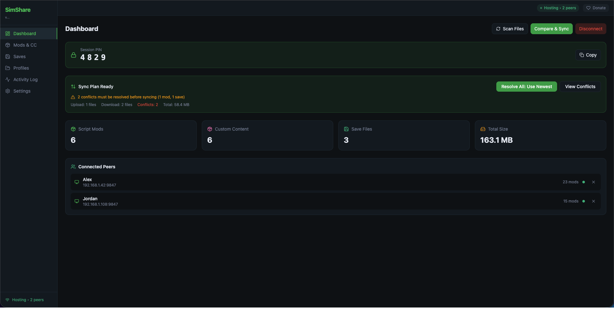
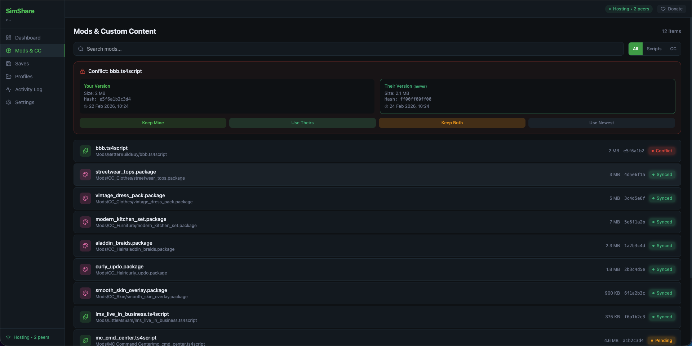
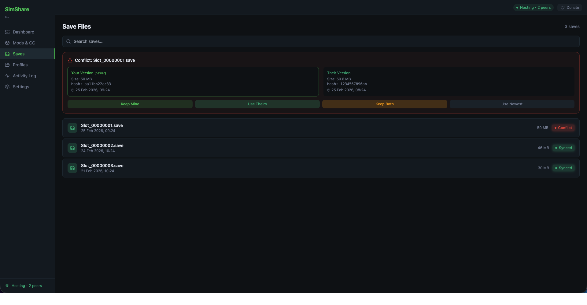
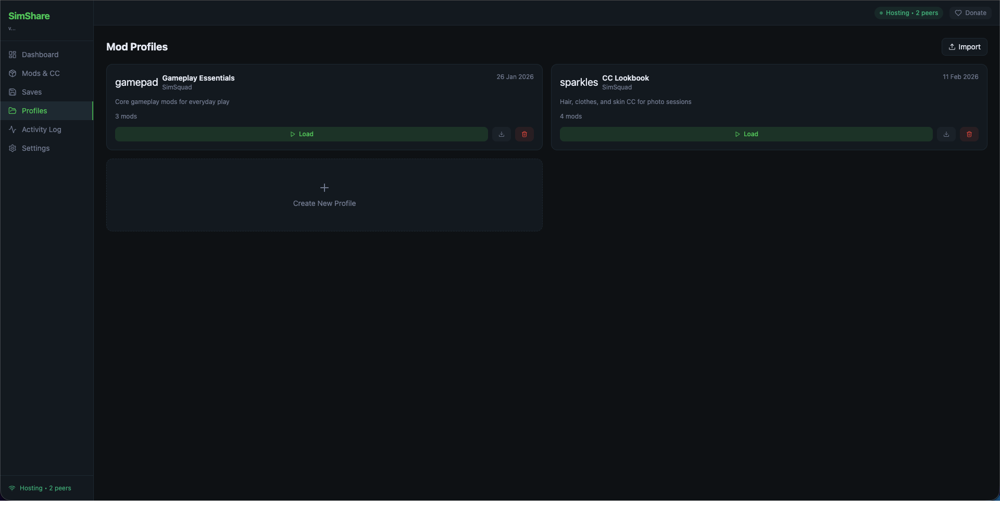
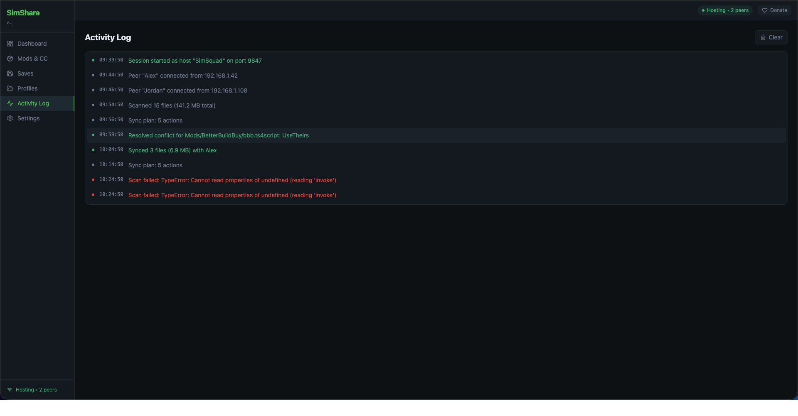

<p align="center">
  
</p>

<h1 align="center">SimShare</h1>

<p align="center">
  <strong>Share Sims 2 / 3 / 4 mods, CC, and saves with friends — directly over your local network.</strong>
</p>

<p align="center">
  <a href="../../releases/latest"></a>
  
  
</p>

<p align="center">
  <a href="../../releases/latest">Download</a>&nbsp;&nbsp;&bull;&nbsp;&nbsp;<a href="https://stixez.github.io/SimShare">Website</a>&nbsp;&nbsp;&bull;&nbsp;&nbsp;<a href="#quick-start">Quick Start</a>&nbsp;&nbsp;&bull;&nbsp;&nbsp;<a href="#building-from-source">Build from Source</a>
</p>

---

## Overview

SimShare is a free, open-source desktop application for syncing Sims 2, Sims 3, and Sims 4 mods, custom content, and save files between players on the same local network. No cloud services, no accounts, no file uploads — files transfer peer-to-peer at full LAN speed.

One player hosts a session, others join. SimShare compares mod folders, surfaces differences and conflicts, and lets each player decide exactly what to sync. Switch between games with a single click — each game has its own paths, profiles, and backups.

---

## Screenshots

<p align="center">
  
</p>
<p align="center"><em>Dashboard — Session overview, sync plan, and connected peers</em></p>

<details>
<summary><strong>More screenshots</strong></summary>

<br>

| Mods & CC | Save Files |
|:-:|:-:|
|  |  |
| *Browse mods, resolve conflicts* | *Manage and sync save files* |

| Profiles | Activity Log |
|:-:|:-:|
|  |  |
| *Snapshot and share mod setups* | *Real-time session events* |

</details>

---

## Features

| | Feature | Description |
|-|---------|-------------|
| **P2P** | Peer-to-peer transfer | Files move directly between computers. Nothing leaves your network. |
| **Multi** | Multi-peer sessions | One host, multiple clients. Each client syncs independently. |
| **Games** | Multi-game support | Switch between Sims 2, Sims 3, and Sims 4 with per-game paths and settings. |
| **mDNS** | Auto-discovery | Finds peers on your network automatically. No IPs to configure. |
| **Diff** | Smart diffing | Compares file hashes. Only transfers what's actually different. |
| **Resolve** | Conflict resolution | Keep yours, use theirs, or keep both — per file. |
| **Tags** | Mod tagging | Organize mods with 12 built-in tags. Bulk-tag, filter, and search. |
| **Selective** | Selective sync | Exclude individual files or use glob patterns. Quick filters by category. |
| **Backup** | Backup & restore | Full snapshot of Mods, Saves, Tray, and Screenshots. Safety backup before every restore. |
| **DnD** | Drag & drop install | Drop `.package`, `.ts4script`, `.zip`, or `.sims3pack` files onto the mod list to install. |
| **DLC** | Pack detection | Detects installed expansion/game/stuff packs and warns about mod compatibility. |
| **Profiles** | Mod profiles | Snapshot your mod setup per game. Export/import as `.simshare-profile` files. |
| **Perms** | Host permissions | Hosts control which folders (Mods, Saves, Tray, Screenshots) peers can sync. |
| **SHA-256** | Integrity verification | Every file is hash-verified after transfer. |
| **Toggle** | Mod enable/disable | Disable mods without deleting them. Moves files to a `_Disabled` folder and back. |
| **Details** | Mod details panel | Click any mod to view full details — path, size, hash, tags, compatibility, and quick actions. |
| **Theme** | Light & dark theme | Toggle between dark and light mode from the sidebar. Preference persists across sessions. |
| **Retry** | Auto-reconnect | Automatic reconnection with exponential backoff if the connection drops unexpectedly. |
| **Live** | Real-time progress | File counts, byte totals, and percentage during sync. |
| **Update** | Auto-update | Check for and install updates directly from the app. |

---

## Download

Get the latest release for your platform from the **[Releases](../../releases/latest)** page.

| Platform | Format |
|----------|--------|
| Windows | `.exe` installer |
| macOS (Apple Silicon) | `.dmg` |
| macOS (Intel) | `.dmg` |
| Linux | `.AppImage` / `.deb` |

> **macOS users:** The app is not signed/notarized yet. macOS will show "app is damaged" on first launch. To fix this, open Terminal and run:
> ```
> xattr -cr /Applications/SimShare.app
> ```
> Then open SimShare normally. You only need to do this once.

---

## Quick Start

### 1. Install

Download and run SimShare on each computer. On first launch a setup card guides you through selecting your game and confirming the detected mod/save paths.

### 2. Pick Your Game

SimShare auto-detects installed Sims 2, Sims 3, and Sims 4 folders. Switch games from the Dashboard or Settings — each game keeps its own paths, profiles, and backups.

### 3. Connect

Both players must be on the **same local network** (same Wi-Fi / router).

| Role | Action |
|------|--------|
| **Host** | Enter a display name > **Start Hosting** |
| **Client** | Enter a display name > **Scan for Hosts** > click the host to connect |

### 4. Compare & Sync

Click **Compare & Sync** on the Dashboard. SimShare scans both mod folders and categorizes every file:

- **Download** — files the peer has that you don't
- **Upload** — files you have that the peer doesn't
- **Conflict** — same file exists on both sides with different contents

Use selective sync to exclude files you don't want, resolve conflicts in the **Mods & CC** or **Saves** tab, then click **Sync Now**.

### 5. Done

Click **Disconnect** when finished. All transferred files are already saved.

---

## Remote Players

Not on the same network? SimShare works over any virtual LAN. We recommend **[Tailscale](https://tailscale.com)** (free for personal use):

1. Both players install Tailscale and join the same network
2. Use SimShare normally — mDNS discovery works through Tailscale

---

## Mod Enable / Disable

Temporarily disable a mod without deleting it. Click any mod to open its details panel, then hit **Disable** — the file moves to `Mods/_Disabled/` so the game won't load it. Hit **Enable** to move it back. Disabled mods are visually dimmed in the list.

---

## Mod Tags

Organize your mods with 12 built-in tags (Hair, Clothing, Build, Gameplay, etc.). Tag mods individually or in bulk, then filter the mod list by tag. Tag filter pills show counts so you can see your collection at a glance.

---

## Backup & Restore

Create a full backup of your Mods, Saves, Tray, and Screenshots folders at any time. Before every restore, SimShare automatically creates a safety backup so you can always roll back. Backups are per-game and shown with a game badge. Rename backups inline to keep them organized.

---

## Selective Sync

Not every file needs to sync. Exclude individual files from the sync plan with a checkbox, or set persistent glob patterns (e.g. `*.ts4script`) in Settings to always skip certain files. Quick filter buttons let you toggle entire categories.

---

## Mod Profiles

Profiles capture a snapshot of your current mod list, scoped to the active game.

| Action | How |
|--------|-----|
| Create | Profiles tab > **+** card > name & description |
| Export | Click export on a profile card > saves a `.simshare-profile` file |
| Import | Click **Import** > select a `.simshare-profile` file |
| Compare | Click **Compare** on a profile card to diff against your current mods |
| Delete | Click the trash icon on a profile card |

---

## Keyboard Shortcuts

| Shortcut | Action |
|----------|--------|
| <kbd>Ctrl+Shift+S</kbd> / <kbd>Cmd+Shift+S</kbd> | Compare & Sync |
| <kbd>Ctrl+Shift+F</kbd> / <kbd>Cmd+Shift+F</kbd> | Focus search |
| <kbd>/</kbd> | Focus search (when not in a text field) |
| <kbd>Esc</kbd> | Close dialogs / clear search |

---

## Building from Source

### Prerequisites

- [Node.js](https://nodejs.org/) 18+
- [Rust](https://rustup.rs/) stable
- Platform dependencies per [Tauri v2 prerequisites](https://v2.tauri.app/start/prerequisites/)

### Build

```bash
git clone https://github.com/stixez/SimShare.git
cd SimShare/simshare
npm install
npm run tauri dev        # development with hot reload
npm run tauri build      # production build with installer
```

Output: `src-tauri/target/release/bundle/`

---

## Architecture

| Layer | Technology |
|-------|-----------|
| Framework | [Tauri v2](https://v2.tauri.app/) |
| Backend | Rust |
| Frontend | React 19 + TypeScript + Vite |
| Styling | Tailwind CSS |
| State | Zustand |
| Networking | TCP (transfer) + mDNS (discovery) |
| Integrity | SHA-256 |

---

## FAQ

<details>
<summary><strong>Is there a file size limit?</strong></summary>
Individual files up to 2 GB. No limit on total sync size.
</details>

<details>
<summary><strong>Can more than two people sync at once?</strong></summary>
Yes. One person hosts, multiple friends join. Each client syncs independently with the host.
</details>

<details>
<summary><strong>Does it only work with Sims 4?</strong></summary>
No. SimShare supports Sims 2, Sims 3, and Sims 4. Switch games from the Dashboard or Settings.
</details>

<details>
<summary><strong>Does it sync tray and screenshot files?</strong></summary>
Yes. SimShare syncs Mods, Saves, Tray, and Screenshots folders. The host can control which folders peers are allowed to sync.
</details>

<details>
<summary><strong>Will it break my mods?</strong></summary>
SimShare never modifies existing files unless you explicitly choose "Use Theirs" on a conflict. It only adds new files or replaces files you approve. A safety backup is created automatically before every restore.
</details>

<details>
<summary><strong>Does it work with pirated copies of The Sims?</strong></summary>
SimShare works with any Sims installation that has a standard Mods and Saves folder structure.
</details>

<details>
<summary><strong>Do both players need the same version?</strong></summary>
Yes. Both should run the same version of SimShare for compatibility. The app can check for updates from Settings.
</details>

<details>
<summary><strong>Can the host restrict what gets synced?</strong></summary>
Yes. The host can set folder permissions to control which folders (Mods, Saves, Tray, Screenshots) peers are allowed to sync. Permissions are enforced server-side.
</details>

---

## Contributing

Contributions are welcome. Open an [issue](../../issues) for bugs or feature requests, or submit a pull request.

---

## Support

If SimShare is useful to you, consider [buying me a coffee](https://www.buymeacoffee.com/stixe).

---

## License

[MIT](LICENSE)
