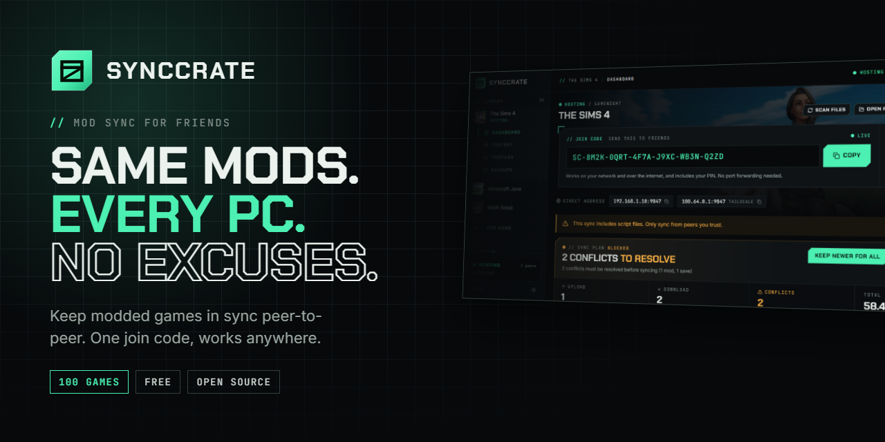
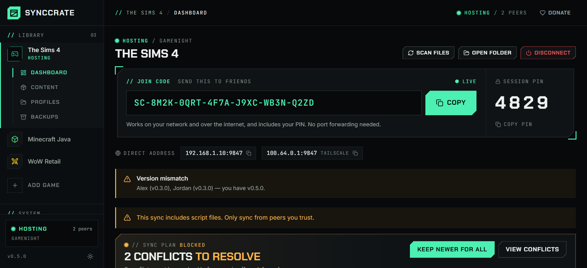
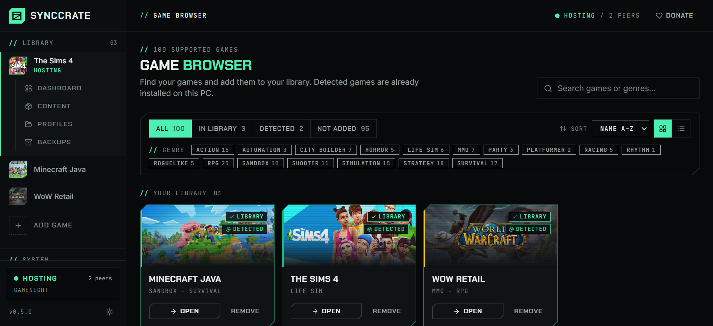
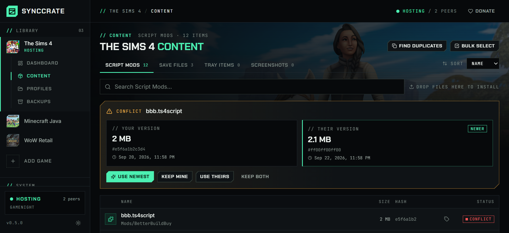
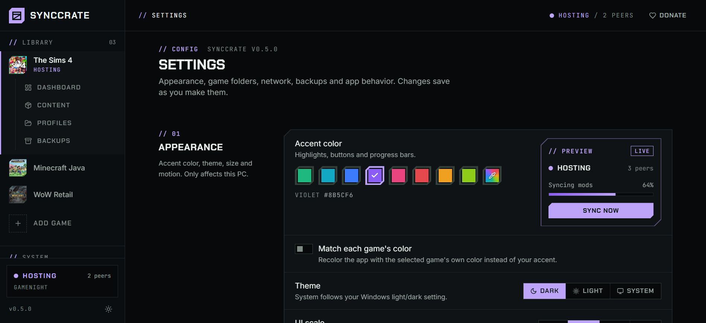

<p align="center">
  
</p>

<h1 align="center">SyncCrate</h1>

<p align="center">
  <strong>Same mods on every PC, for co-op squads and LAN parties.</strong>
</p>

<p align="center">
  <a href="../../releases/latest"></a>
  
  
  <a href="https://buymeacoffee.com/stixe"></a>
</p>

<p align="center">
  <a href="../../releases/latest"><strong>Download</strong></a>&nbsp;&nbsp;&bull;&nbsp;&nbsp;<a href="https://stixez.github.io/SyncCrate">Website</a>&nbsp;&nbsp;&bull;&nbsp;&nbsp;<a href="#get-started">Get started</a>&nbsp;&nbsp;&bull;&nbsp;&nbsp;<a href="#supported-games">Games</a>&nbsp;&nbsp;&bull;&nbsp;&nbsp;<a href="#faq">FAQ</a>
</p>

<p align="center">
  
</p>

One mismatched mod and nobody can join. **SyncCrate makes every PC match the host by copying only the files that differ, straight from PC to PC.** No cloud, no accounts, no tracking.

## Why SyncCrate

- **Everyone can join.** Friends pull the host's exact mods, configs and saves, so nobody is stuck on "version mismatch" in the lobby.
- **Built for LAN parties.** One PC feeds the whole room at 100–900 MB/s. Hosts are found automatically, no internet needed.
- **Or from anywhere.** At home, friends paste one join code. Peer-to-peer and encrypted, no port forwarding or VPN.
- **Nothing breaks.** You see the plan before anything changes, conflicts are yours to decide, every file is verified and backups let you roll back.
- **100 games, real box art.** Valheim, Lethal Company, Minecraft, Baldur's Gate 3, The Sims 4 and more, found on every drive.

<table>
  <tr>
    <td width="50%"></td>
    <td width="50%"></td>
  </tr>
  <tr>
    <td width="50%"></td>
    <td width="50%"></td>
  </tr>
</table>

## Get Started

1. **Download** SyncCrate for Windows, macOS or Linux from [Releases](../../releases/latest) and install it on every PC.
2. **Add your game** in the Game Browser. Its folder is detected automatically, or set it manually.
3. **One friend clicks Start Hosting.** Everyone else picks the host under **Scan for Hosts** (same network) or pastes the join code (anywhere).
4. **Click Compare & Sync**, check the plan, then **Sync Now**.

> [!TIP]
> Can't connect? On the **host** PC click **Fix Windows Firewall** (shown while hosting and in *Network Check*). It asks for admin permission once; SyncCrate itself never needs to run as administrator.

> [!NOTE]
> **macOS:** the app isn't notarized yet, so macOS may call it "damaged". Run `xattr -cr /Applications/SyncCrate.app` once, then open it normally.

Downloads: Windows `.exe` / `.msi` · macOS `.dmg` (Apple Silicon and Intel) · Linux `.AppImage` / `.deb` / `.rpm`. The app updates itself.

<details>
<summary><strong>All features</strong></summary>

**Sync**
- **Only what changed.** SHA-256 diffing, zstd compression (50–80% less data), 100–900 MB/s peer-to-peer on LAN.
- **You decide.** Review the plan with size and time estimate, exclude files or glob patterns, and resolve conflicts per file: keep yours, use theirs, keep both, or keep newer.
- **Resumable.** Cancel or lose the connection mid-sync and it picks up where it left off. Desktop notification when done.

**Connect**
- **Join codes that work anywhere.** The host shares one `SC-…` code and friends paste it, on the same Wi-Fi or across the internet. Reconnecting takes one click. Or send **Copy invite link** (`synccrate://join/…`): clicking it opens SyncCrate with the code filled in for the right game (or offers to switch games). Nothing connects or syncs until the friend clicks Join and confirms the plan.
- **Auto-discovery.** Finds hosts via mDNS and UDP broadcast and tries every address a host has.
- **Multi-peer.** One host, many friends, each syncing independently. Hosts choose which folders peers may sync.

**Mods**
- **Mod manager.** Browse by folder, filter by status, type and tag, and enable or disable one mod or a whole creator folder. 12 tags, drag & drop install (each file goes to the folder its type belongs in), pack/DLC detection and a duplicate finder for games where duplicate packages cause trouble (The Sims 2/3/4, Euro/American Truck Simulator, Farming Simulator). Handles 20,000+ files smoothly.
- **Game browser.** 100 games with official box art, filtered by genre and status, in a grid or a list. Set your own cover for any game.
- **Profiles.** Snapshot a setup and share it as a `.synccrate-profile` file on Discord.

**Share your setup**
- **Modpacks.** Export "my exact setup" as a tiny `.scpack` manifest — game, content types, and a file list (path, size, hash), no file contents, so it stays shareable-sized even for a big CC folder. A friend imports it (double-click the `.scpack` file, drag & drop, click a `synccrate://pack/…` link, or paste the link for small packs) and sees what they have, what's missing, and what differs, grouped like the Content page. Connect to whoever's sharing it and "Get missing files" pulls exactly the pack's files — differences become the normal conflict prompt, files the host doesn't have are reported rather than silently skipped, and nothing outside the pack is ever touched.
- **Apply pack exactly.** When the whole group has to run the same mods, "Apply pack exactly" makes your game load just the pack's mods. It previews what it will download, which conflicts you'll resolve, and which mods it will re-enable or disable. Then it syncs, and only if the sync finishes cleanly does it re-enable pack files you had disabled and disable mods the pack doesn't list, using the game's normal disable method. Nothing is deleted, and saves and other content are never touched. "Revert pack apply" puts those files back with one click (downloads are undone with "Undo last sync"). It isn't available for games whose mods can't be disabled file by file, like Stardew Valley and KSP.

**Play together**
- **Session chat.** Every session has a chat on the Dashboard, so you don't need Discord open next to it. The host keeps the conversation, and it works on the LAN and over the internet with no extra servers. It shows who joined or left and who finished syncing how many files. Your name is highlighted when someone writes `@you`, and you get a notification if SyncCrate is in the background. Messages last only for the session. While a sync is running, a friend's messages wait and arrive right after it. The host needs SyncCrate 0.6 or newer.
- **Crews.** A crew remembers your group ("Sunday Sims Crew"): who's in it, which games you play, and the crew's mod set for each game. Start one on the Crews page and send **Copy invite** (`synccrate://crew/…`). Clicking the link adds the crew, and nothing connects or syncs.
  - **Crew set.** Whoever hosts can "Publish my setup as the crew set", which is an ordinary modpack. Members get it the next time they connect to that host. The Crews page then says how many files you're behind, and **Catch up** opens the usual pack view ("Get missing files" or "Apply pack exactly").
  - **No codes.** Once you've synced with someone in the crew, **Reconnect** or **Join** on a member reaches them by their SyncCrate id, over the internet or on the same network. **Who's hosting?** finds members hosting on your LAN.
  - **Stays private.** Crews live on your PCs only and are shared host → client during a normal session. Being in a crew never gets anyone past the PIN or the wrong-game check, so the invite contains no PIN: set one when you host. Removing a member stops sharing crew info with them and spreads to the others as they connect. But the removed person keeps their copy, so to really lock someone out, change your PIN.

**Safety**
- **Backups.** Manual or automatic, stored incrementally: unchanged files are kept once and shared between backups, so extra backups cost almost nothing. Scheduled backups cover each game in your library on its own 1–24 h timer (even across restarts). "Back up before sync" saves just the files a sync is about to replace or delete, and the sync stops if that backup fails. Restores keep file dates, skip mods you have disabled since, can optionally be exact (also removing files added since the backup), and always take a safety backup first.
- **Undo last sync.** Right after a sync, one click puts your files back exactly as they were — replaced files return byte- and date-identical, added files (including "keep both" copies) are removed, and anything you've touched since is left alone and reported instead of overwritten. Only the most recent sync per game can be undone, and only from the client side.
- **Script warnings.** Flags risky files (`.dll`, `.ts4script`, `.lua`, `.jar`) before syncing.
- **Private.** Files never leave your PCs. Warns you if the game is still running.

**Yours**
- **Appearance.** Any accent color (or each game's own), dark/light/system theme, UI scale, compact rows, and effects off for a calmer look.

**Shortcuts:** <kbd>Ctrl/Cmd+Shift+S</kbd> Settings · <kbd>/</kbd> or <kbd>Ctrl+F</kbd> search · <kbd>Esc</kbd> close / clear.

</details>

## Supported Games

<!-- GAMES:START -->
**100 games across 67 families**, defined in a [JSON registry](synccrate/src-tauri/src/game_registry.json). Missing one? [Add it](#adding-a-game), no code needed.

<details>
<summary><strong>Life sim</strong> — 5 games</summary>

| Game | What syncs |
|------|------------|
| **The Sims 2** | Mods & CC, Neighborhoods, Tray Items, Screenshots |
| **The Sims 3** | Mods & CC, Save Files, Tray Items, Screenshots |
| **The Sims 4** | Script Mods, Save Files, Tray Items, Screenshots |
| **The Sims 4 (GShade)** | GShade Presets, GShade Shaders |
| **The Sims 4 (ReShade)** | ReShade Presets, ReShade Shaders, ReShade Presets (Bin) |

</details>

<details>
<summary><strong>Survival & co-op</strong> — 11 games</summary>

| Game | What syncs |
|------|------------|
| **7 Days to Die** | Mods, Save Files, Server Configs |
| **ARK: Survival Evolved** | Mods, Save Files |
| **Barotrauma** | Local Mods |
| **Conan Exiles** | Mods |
| **Don't Starve** | Mods |
| **Don't Starve Together** | Mods |
| **Palworld** | Mods |
| **Project Zomboid** | Mods, Save Files |
| **Subnautica** | Mods (QMods), Save Files |
| **V Rising** | Plugins (BepInEx), Mod Configs |
| **Valheim** | Plugins (BepInEx), Mod Configs |

</details>

<details>
<summary><strong>Sandbox</strong> — 6 games</summary>

| Game | What syncs |
|------|------------|
| **Garry's Mod** | Addons, Maps, Saves |
| **Minecraft Java** | Mods, Worlds, Resource Packs, Shader Packs |
| **Space Engineers** | Mods, Worlds, Blueprints |
| **Starbound** | Mods, Characters, Universe |
| **Terraria** | Worlds, Players, tModLoader Mods, Resource Packs |
| **Vintage Story** | Mods, Save Files, Mod Configs |

</details>

<details>
<summary><strong>Automation</strong> — 3 games</summary>

| Game | What syncs |
|------|------------|
| **Dyson Sphere Program** | Plugins (BepInEx), Mod Configs |
| **Factorio** | Mods, Save Files, Scenarios |
| **Satisfactory** | Mods (SMM) |

</details>

<details>
<summary><strong>RPG</strong> — 15 games</summary>

| Game | What syncs |
|------|------------|
| **Baldur's Gate 3** | Mods, Mod Load Order, Save Files |
| **Cyberpunk 2077** | Archive Mods, Redscript Mods, TweakXL Tweaks, Cyber Engine Tweaks Mods, RED4ext Plugins |
| **Darkest Dungeon** | Mods |
| **Dragon Age: Origins** | Override Mods, AddIns (DAZip), Save Files |
| **Fallout 4** | Mods & Plugins |
| **Fallout: New Vegas** | Mods & Plugins |
| **Kenshi** | Mods, Save Files |
| **Kingdom Come: Deliverance II** | Mods |
| **Skyrim (Legendary Edition)** | Mods & Plugins |
| **Skyrim Special Edition** | Mods & Plugins |
| **Starfield** | Mods & Plugins |
| **The Elder Scrolls III: Morrowind** | Mods & Plugins |
| **The Elder Scrolls IV: Oblivion** | Mods & Plugins |
| **The Witcher 3: Wild Hunt** | Mods, Mod Menus |
| **Torchlight II** | Mods |

</details>

<details>
<summary><strong>MMO</strong> — 7 games</summary>

| Game | What syncs |
|------|------------|
| **WoW Classic** | Addons, Addon Settings |
| **WoW Classic Era** | Addons, Addon Settings |
| **WoW Custom Server** | Addons, Addon Settings |
| **WoW Retail** | Addons, Addon Settings |
| **WoW TBC (2.4.3)** | Addons, Addon Settings |
| **WoW Vanilla (1.12)** | Addons, Addon Settings |
| **WoW WoTLK (3.3.5)** | Addons, Addon Settings |

</details>

<details>
<summary><strong>Strategy</strong> — 16 games</summary>

| Game | What syncs |
|------|------------|
| **Crusader Kings III** | Mods, Save Files |
| **Europa Universalis IV** | Mods, Save Files |
| **Hearts of Iron IV** | Mods, Save Files |
| **Mount & Blade II: Bannerlord** | Modules |
| **Mount & Blade: Warband** | Modules |
| **RimWorld** | Mods, Save Files |
| **Sid Meier's Civilization VI** | Mods, Save Files |
| **Stellaris** | Mods, Save Files |
| **Stronghold 2** | Custom Maps |
| **Stronghold Crusader 2** | Custom Maps |
| **Stronghold HD** | Custom Maps |
| **Stronghold: Crusader HD** | Custom Maps |
| **The Riftbreaker** | Mods |
| **Victoria 3** | Mods, Save Files |
| **Warcraft III** | Custom Maps |
| **XCOM 2** | Mods (Base Game), Mods (War of the Chosen) |

</details>

<details>
<summary><strong>City builders</strong> — 3 games</summary>

| Game | What syncs |
|------|------------|
| **Cities: Skylines** | Mods, Assets, Save Files, Maps |
| **Cities: Skylines II** | Local Mods, Save Files, Maps |
| **SimCity 4** | Plugins, Regions |

</details>

<details>
<summary><strong>Simulation</strong> — 7 games</summary>

| Game | What syncs |
|------|------------|
| **American Truck Simulator** | Mods, Profiles |
| **Euro Truck Simulator 2** | Mods, Profiles |
| **Farming Simulator 22** | Mods |
| **Farming Simulator 25** | Mods |
| **Kerbal Space Program** | Mods, Save Files |
| **Oxygen Not Included** | Local Mods, Save Files |
| **Stardew Valley** | SMAPI Mods |

</details>

<details>
<summary><strong>Shooters</strong> — 7 games</summary>

| Game | What syncs |
|------|------------|
| **Arma 3** | Missions, MP Missions |
| **Call of Duty** | Mods |
| **Call of Duty 2** | Mods |
| **Call of Duty 4: Modern Warfare** | Mods, Custom Maps |
| **Counter-Strike 2** | Maps, Configs |
| **Left 4 Dead 2** | Addons & Maps, Configs |
| **Team Fortress 2** | Custom (HUDs, Skins, Sounds), Maps, Configs |

</details>

<details>
<summary><strong>Action</strong> — 4 games</summary>

| Game | What syncs |
|------|------------|
| **Blade & Sorcery** | Mods |
| **Grand Theft Auto V** | Scripts, OpenIV Mods Folder |
| **Monster Hunter: World** | nativePC Mods |
| **Red Dead Redemption 2** | Lenny's Mod Loader, Scripts |

</details>

<details>
<summary><strong>Horror</strong> — 2 games</summary>

| Game | What syncs |
|------|------------|
| **Lethal Company** | Plugins (BepInEx), Mod Configs |
| **R.E.P.O.** | Plugins (BepInEx), Mod Configs |

</details>

<details>
<summary><strong>Roguelikes</strong> — 4 games</summary>

| Game | What syncs |
|------|------------|
| **Balatro** | Mods (Steamodded/Lovely), Save Profile 1, Save Profile 2, Save Profile 3 |
| **Noita** | Mods |
| **Risk of Rain 2** | Plugins (BepInEx), Mod Configs |
| **Slay the Spire** | Mods, Save Files, Preferences & Profiles |

</details>

<details>
<summary><strong>Racing</strong> — 5 games</summary>

| Game | What syncs |
|------|------------|
| **Assetto Corsa** | Cars, Tracks |
| **Trackmania (2020)** | Maps, Replays, Skins |
| **TrackMania 2: Stadium** | Maps, Replays, Skins |
| **TrackMania Nations Forever** | Tracks, Replays, Skins |
| **TrackMania United Forever** | Tracks, Replays, Skins |

</details>

<details>
<summary><strong>Platformers</strong> — 2 games</summary>

| Game | What syncs |
|------|------------|
| **Celeste** | Mods (Everest), Save Files |
| **Hollow Knight** | Mods |

</details>

<details>
<summary><strong>Party</strong> — 2 games</summary>

| Game | What syncs |
|------|------------|
| **Among Us** | Plugins (BepInEx), Mod Configs |
| **Tabletop Simulator** | Save Files, Workshop Mods |

</details>

<details>
<summary><strong>Rhythm</strong> — 1 game</summary>

| Game | What syncs |
|------|------------|
| **Beat Saber** | Custom Songs, Plugins (BSIPA), Plugin Libraries, Custom Sabers, Mod Configs |

</details>
<!-- GAMES:END -->

## Game-Specific Extras

**Co-op games with BepInEx** (Valheim, Lethal Company, R.E.P.O., Risk of Rain 2, …): `BepInEx/plugins` and `BepInEx/config` sync as separate folders, so the host can share plugins but keep personal configs. Plugin `.dll` files are flagged as scripts before syncing. Disabling a plugin renames it to `.dll.disabled` (BepInEx loads every subfolder, so moving it wouldn't work). Stardew Valley (SMAPI) and Kerbal Space Program mods are whole folders, so they can't be switched off file by file in SyncCrate.

**The Sims 4**
- **ReShade & GShade presets.** Add *The Sims 4 (ReShade)* or *(GShade)* to share shaders and presets so everyone's game looks the same. Detected in `Game\Bin` on EA App, Origin and Steam installs. Your own `ReShade.ini` / `GShade.ini` is never synced.
- **Thumbnail cache** is cleared automatically after new mods arrive.
- **Disabling that sticks.** The game loads mods from subfolders, so disabled mods are renamed to `.disabled` instead of moved. Mods left in an old `_Disabled` folder are fixed in one click.
- **Outdated script mods** are flagged after a game patch.

**LAN party tips:** run the host on wired Ethernet, click **Fix Windows Firewall** on the host before people arrive, and let friends sync in waves (everyone shares the host's upload). Friends can also sync at home the night before using the join code.

## FAQ

<details>
<summary><strong>Does it work at a LAN party with no internet?</strong></summary>

Yes. On a local network SyncCrate finds hosts with mDNS and UDP broadcast and syncs PC to PC at 100–900 MB/s. Friends pick the host under **Scan for Hosts** or use Connect by IP.
</details>

<details>
<summary><strong>How many friends can sync from one host?</strong></summary>

There's no fixed limit. Each friend syncs independently, whenever they're ready, so people can join halfway through the evening. The host's upload is the bottleneck: friends syncing at the same time share it.
</details>

<details>
<summary><strong>My friend can't connect. What do I do?</strong></summary>

It's almost always Windows Firewall. On the host PC click **Fix Windows Firewall**, then use **Test** in *Network Check* to see whether the host is reachable. SyncCrate uses TCP port 9847 for sessions and UDP port 47625 for discovery.
</details>

<details>
<summary><strong>Do I need to run it as administrator?</strong></summary>

No. The only exception is a game folder Windows protects, such as ReShade/GShade under `Program Files`. SyncCrate tells you and offers to restart as administrator.
</details>

<details>
<summary><strong>Can I sync with friends who aren't on my network?</strong></summary>

Yes. Paste the host's join code, and nothing else is needed. SyncCrate connects directly between the two PCs when it can (hole punching through home routers, powered by [iroh](https://iroh.computer)). When that isn't possible, it falls back to an encrypted relay server. The relay only forwards data it can't read, and it only helps set up connections; your files are never stored anywhere. On the same network the fast LAN connection is used automatically.

Anyone with your code can join, so turn on **Use PIN** if you post the code publicly. A virtual LAN like Tailscale or ZeroTier also still works with Connect by IP.
</details>

<details>
<summary><strong>Is there a file size limit?</strong></summary>

Up to 2 GB per file, no limit on total size.
</details>

<details>
<summary><strong>Is it safe? Will it break my mods?</strong></summary>

Nothing changes until you approve the sync plan, and existing files are only replaced when you choose to. The duplicate finder only looks at the mods folder, and before deleting a duplicate it re-checks that the copy you keep is still there and identical. Restoring a backup skips mods you've disabled or enabled since. Every file is hash-verified after transfer, risky script files are flagged, and backups let you roll back. Only sync with people you trust, and make sure everyone runs the same SyncCrate version.
</details>

<details>
<summary><strong>My game isn't detected or supported.</strong></summary>

Set the folder manually in Settings; any install with the expected folder structure works, Steam or not. A folder you pick yourself counts as installed. SyncCrate refuses drive roots, your user, Documents, Desktop and Downloads folders, and a folder that overlaps another game's folder. If the folder has none of the game's usual subfolders, it asks before using it. To add a new game, see [Adding a game](#adding-a-game).

"Detected" means SyncCrate found the game *installed* (a Steam, Epic or GOG install, or an entry in Windows' installed apps). If only its mods/saves folder exists, for example left behind after an uninstall, SyncCrate doesn't use that folder until you set it yourself.
</details>

<details>
<summary><strong>Settings says "Folder not found — drive disconnected?"</strong></summary>

The folder you set for that game doesn't exist right now, for example because it's on an external drive that isn't plugged in. SyncCrate keeps your setting and won't scan, sync or restore that game until the folder is back. Reconnect the drive, or pick the folder again in Settings.
</details>

## Contributing

Issues and pull requests are welcome.

### Adding a Game

Games live in one [JSON file](synccrate/src-tauri/src/game_registry.json): detection paths, content types and file extensions. No Rust or TypeScript changes needed. Detection strategies are tried in order and the first existing path wins:

| Strategy | Example |
|---|---|
| `documents_relative` | `{"type": "documents_relative", "base": "My Games", "folders": ["Fallout4"]}` |
| `absolute_paths` | `{"type": "absolute_paths", "paths": {"windows": ["%APPDATA%\\VintagestoryData"], "linux": ["~/.config/VintagestoryData"]}}` |
| `steam_library` | `{"type": "steam_library", "folders": ["Fallout 4/Data"]}` (checked in every Steam library) |
| `windows_registry` | `{"type": "windows_registry", "keys": ["HKLM\\SOFTWARE\\Maxis\\The Sims 4"], "value": "Install Dir", "subpath": "Game\\Bin"}` |

Add `"require_any": ["SomeMarker.ini"]` next to `strategies` to only match folders containing one of those files or folders (used for ReShade/GShade). Each content type needs a real subfolder, and its `icon` must exist in `ICON_MAP` in `synccrate/src/components/Sidebar.tsx`. Add `"steam_app_id"` (the number in the game's Steam store URL) so the game gets box art. For games not on Steam, add `"art_urls": {"hero": "https://…"}` pointing to official publisher-hosted key art. Tag the game with `"genres"` from the list in `registry.rs` (`GENRES`). "Detected" also needs install evidence: the Steam app id, or a Windows uninstall / Epic / GOG entry matching the game's `label`. If the installed name differs, add `"install_names": ["World of Warcraft"]`. For games found neither way, add `"install_markers"`: a file relative to the game folder (`"Wow.exe"`), an absolute path (`"%ProgramFiles(x86)%/Game/Game.exe"`) or a registry directory (`"HKLM\\SOFTWARE\\Maxis\\The Sims 4::Install Dir"`). Content type folders must not overlap (one nested in another), which a test checks. Set `"disable_method": "rename"` if the game loads mods from subfolders (disabling then renames to `.disabled`), `"none"` if mods are whole folders that can't be toggled per file, and `"duplicate_finder": true` only if identical files in different mod folders are genuinely a problem for the game.

### Building from Source

Requires [Node.js](https://nodejs.org/) 18+, [Rust](https://rustup.rs/) stable and the [Tauri v2 prerequisites](https://v2.tauri.app/start/prerequisites/).

```bash
git clone https://github.com/stixez/SyncCrate.git
cd SyncCrate/synccrate
npm install
npm run tauri dev     # dev with hot reload
npm run tauri build   # installer in src-tauri/target/release/bundle/
```

Stack: Tauri v2 · Rust · React 19 + TypeScript + Vite · Tailwind CSS · Zustand · TCP transfer with mDNS + UDP discovery.

## Support & License

If SyncCrate saves your game night, consider [buying me a coffee](https://www.buymeacoffee.com/stixe). Released under the [MIT License](LICENSE).
